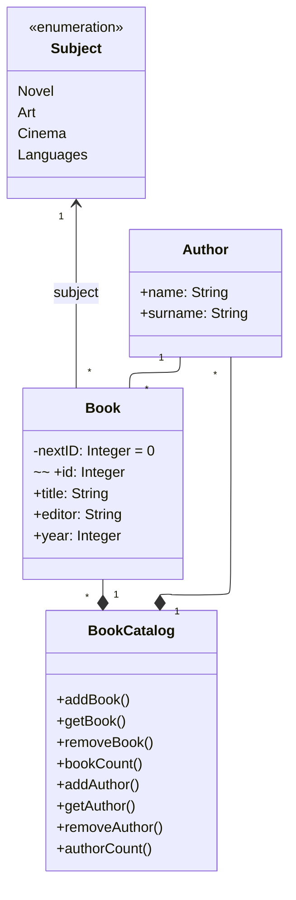

# BookCatalogApp

## Propósito de la píldora y los objetivos de aprendizaje
- Aprender a implementar en Java el diagrama de clases que describe el modelo conceptual de la aplicación.
- Ejercitar el desarrollo de aplicaciones en Java con IntelliJ.

1. Implementar con IntelliJ un pequeño prototipo de una aplicación de librería a partir del siguiente diagrama de clases:



a. Creamos un nuevo proyecto Java llamado BookCatalogApp. Al módulo que se crea por defecto lo llamamos catalog.

b. Dentro de la carpeta src creamos un paquete llamado org.ulpgc.is1. Dentro de ese paquete creamos otros dos paquetes al mismo nivel llamados control y model. Movemos al paquete control la clase Main que se nos creó por defecto al crear el proyecto. En el paquete model, creamos todas las clases de nuestro diagrama de clases: BookCatalog, Book, Subject y Author.

c. En cada clase incluiremos los atributos identificados. Hemos de tener en cuenta que, además de los atributos indicados explícitamente, las asociaciones, agregaciones o composiciones llevan implícitos otros atributos, como se indica en el siguiente apartado.

d. En las clases que tienen una composición o agregación de instancias de otra clase, utilizaremos atributos de tipo List para representar esas relaciones. Para poder usarlo, es necesario incluir la sentencia import java.util.List al comienzo. Se utilizará la implementación ArrayList. Además, se incluirán en la clase que contenga la composición o agregación, los métodos para añadir, eliminar o acceder a los elementos del List.

e. Los tipos enumerados se implementarán como se indica en las diapositivas de clase.

f. Crearemos los constructores para las diferentes clases. Por ejemplo:
```
    public BookCatalog(){
        bookList =new ArrayList();
        authorList = new ArrayList();
    }
```
g. En cada clase incluiremos los métodos identificados en el diagrama. Además, se incluirán métodos getters y setters para el acceso a todos los atributos de cada clase.

h. En el main, debemos poner import model.BookCatalog antes de la declaración de la clase el siguiente código:
```
import model.BookCatalog;
import model.Subject;
```
i. Para probar, como aún no tenemos una interfaz para interactuar con el modelo. Dentro del método MAIN poner el siguiente código:
```
public static void main(String[] args) {
        BookCatalog catalog = new BookCatalog();

        catalog.addAuthor("ELÍSABET", "BENAVENT");
        catalog.addAuthor("ANDREW", "GRAHAM-DIXON");
        catalog.addAuthor("IAN", "NATHAN");

        catalog.addBook("LOS ABRAZOS LENTOS", "SUMA DE LETRAS, S.L.", 2022, Subject.Novel, catalog.getAuthor(0));
        catalog.addBook("CARAVAGGIO. UNA VIDA SAGRADA Y PROFANA", "TAURUS", 2022, Subject.Art, catalog.getAuthor(1));
        catalog.addBook("GUILLERMO DEL TORO. EL LABERINTO FILMICO DE UN DIRECTOR PRODIGIOSO", "CÚPULA", 2022, Subject.Cinema, catalog.getAuthor(2));

        System.out.println("El catálogo contiene " + catalog.bookCount() + " libro(s)");
        System.out.println("El primer libro es " + catalog.getBook(0).getTitle());
        System.out.println("El autor del primer libro es " + catalog.getBook(0).getAuthor().getName());
        System.out.println("El segundo libro es " + catalog.getBook(1).getTitle());
        catalog.removeBook(1);
        System.out.println("El catálogo contiene " + catalog.bookCount() + " libro(s)");
        System.out.println("");

        Author author = catalog.getAuthor(0);

        System.out.println(author.getName() + " tiene " + author.bookCount() + " libro(s)");
        System.out.println("Los libros vinculados a este autor son: ");
        for (int i = 0; i < author.bookCount(); i++) {
            System.out.println("Libro " + i + ": " + author.getBook(i).getTitle());
        }
    }
```

Esto creará una nueva instancia de BookCatalog, inicializará el modelo con tres libros, tres autores y mostrará el número de libros del catálogo, así como el nombre de dos libros que hay en la librería y el autor de uno de ellos. Posteriormente, borrará un libro y mostrará el número de libros que hay. Por último, se mostrará los libros del primer autor.